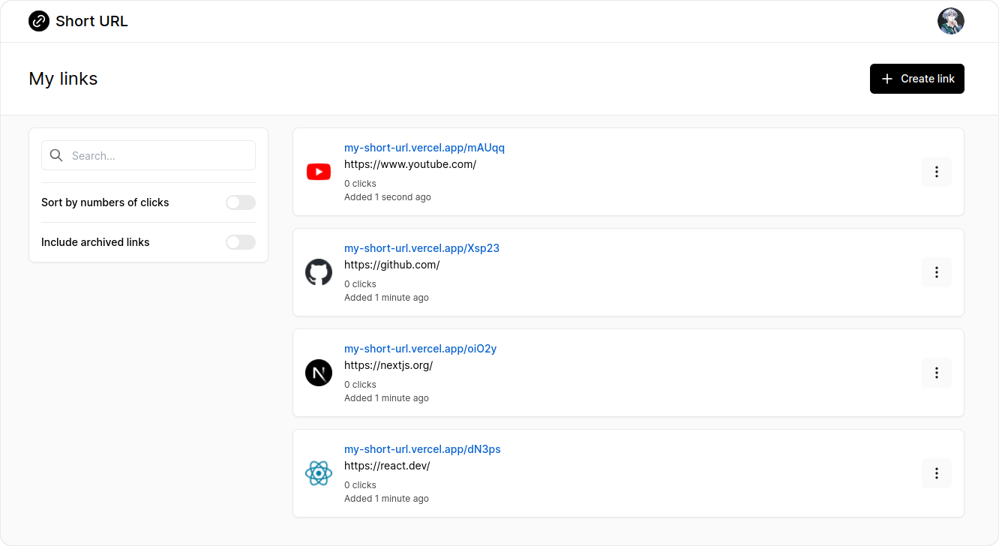

# Short URL

> Short links with superpowers

## Introduction

[Short URL](https://my-short-url.vercel.app/) is an open-source link management tool for modern
marketing teams to create, share, and track short links.

## What is Short URL?

- Short URL is a URL Shortener and Link Management Platform. It offers a lot of features that will help you handle all your links in an intuitive way and reveal the potential of your links.
- Short URL is an advanced Link Analytics platform that tracks clicks on short links and provides extensive statistics to help you measure the effectiveness of your short links.
- With Short URL, you can easily generate QR codes. Use QR codes to grow your business and measure their impact on your marketing efforts.
- With Short URL, you can easily password protect your shortened links. Use this feature to protect links against unauthorized access.

## Tech stack

- [Next.js](https://nextjs.org/) - framework
- [TypeScript](https://www.typescriptlang.org/) - language
- [NextAuth.js](https://next-auth.js.org/) - auth
- [Prisma](https://www.prisma.io/) - ORM
- [Vitest](https://vitest.dev/) - test runner
- [Tailwind](https://tailwindcss.com/) - CSS
